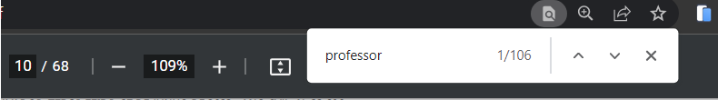
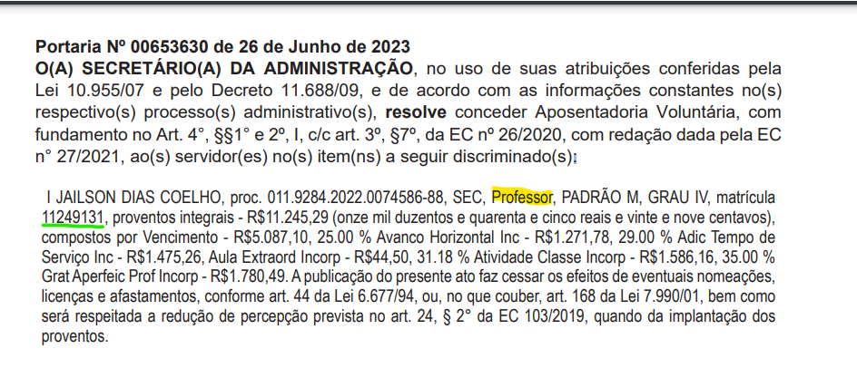
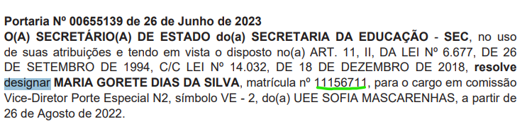
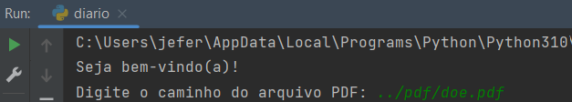
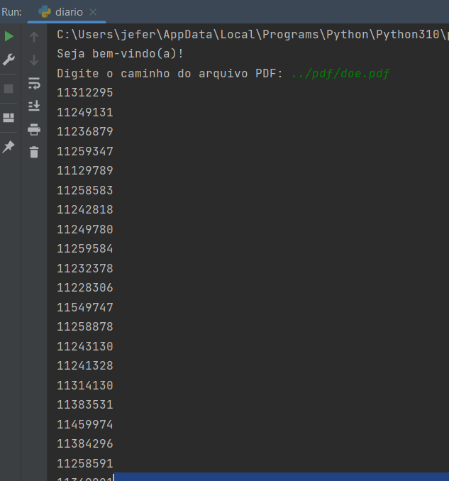

# Extração de matrículas no Diário Oficial - BA

## 🔗 Índice
-   <a href="#📋-sobre">Sobre</a>
-   <a href="#🎯-tecnologias-utilizadas">Tecnologias utilizadas</a>
-   <a href="#🪲-problema---consulta-manual">Problema - Consulta manual</a>
-   <a href="#♨️-como-usar">Como usar</a>
-   <a href="#🌐-referências">Referências</a>

## 📋 Sobre

Projeto desenvolvido para facilitar a busca das matrículas dos professores e gestores escolares no Diário Oficial do Estado da Bahia.

## 🎯 Tecnologias utilizadas:
-   Python
-   re
-   pdfplumber
-   xlsxwriter
  
## 🪲 Problema - Consulta manual

O problema em questão é o demasiado tempo dedicado a consultar os servidores escolares no Diário Oficial. Fazer esse trabalho <strong>TODOS OS DIAS</strong> preenche um espaço do tempo nos servidores da SEC/CPG que poderia ser dedicado em outras tarefas que são mais urgentes.

 

- ### Quantidade de matrículas para buscar: 

 

- ### Depois de inserir a palavra-chave...
- ### Pega a matricula, caso seja um professor ou gestor
</img>
</img>

Pensando em maximizar o tempo gasto nisso, resolvi criar essa extração de texto automatizada com o Python.

## ♨️ Como usar
-   Mensagem de boas-vindas
-   Solicitação para inserir o caminho do arquivo PDF
-   Será exibido as matrículas encontradas
-   E depois o aviso de exportação para Excel com sucesso

 

### Vídeo demonstrativo:
<video src="video/doe-ba%20%E2%80%93%20diario.py%202023-07-02%2015-32-49%20(online-video-cutter.com).mp4" controls title="Title"></video>
   

### Etapa 1

### Etapa 2

<strong>Até então só está disponível a versão via terminal ❗</strong>

 

## 🌐 Referências

Aprendi alguns conceitos importantes com:

  
  - https://www.youtube.com/@nerddosdados
  - https://www.youtube.com/@WalissonSilva